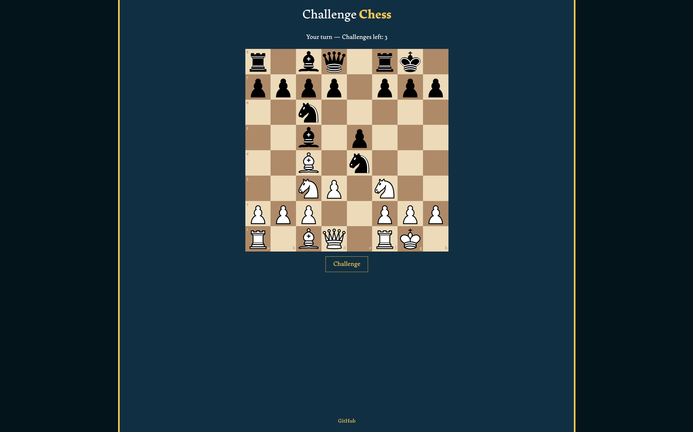
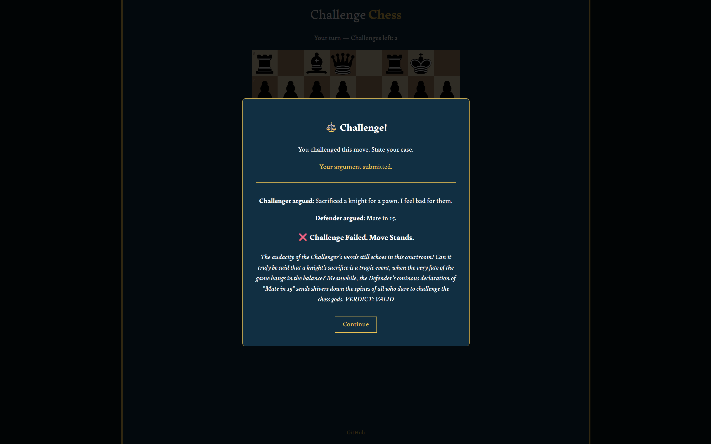

<div align="center">


# Challenge Chess

A Chess variant where players can challenge their opponent's captures before a judge.

[](./LICENSE)


</div>

## ✨ Features

- Dispute captures with an AI judge
- Win a challenge to undo a move & get a free turn, or lose and give them one

## 📦 Built With

| Tool | Purpose |
| - | - |
| chess.js | Game logic and validation |
| react-chessboard | Interactive Chessboard UI |

## 📸 Preview

<div style="display: flex; gap: 10px; justify-content: center">
    
    
</div>

## 🚀 Installation

The easiest way to play is going to the website: [https://challenge-chess.vercel.app](https://challenge-chess.vercel.app).

Or, if you wish to play it locally, here are the steps:

> Note: The current setup does not use VITE_ for the AI API key and is server-side. In other words, the AI will not work locally and will fallback to a static random outcome. While this functionality may be added in the future, if you wish to use AI locally as of now, you will have to make changes to the code.

### 1. Prerequisites

- [Firebase](https://console.firebase.google.com) project with Firestore
- [Gemini](https://aistudio.google.com/) or [Groq](https://console.groq.com/) API key

> Note: There are two styles of prompts for Gemini and Groq in [src/lib/judge.ts](./src/lib/judge.ts). If you wish to use another AI's API, you may have to change the prompt accordingly.

### 2. Downloading the Code

Clone the repository through a terminal, such as Command Line or Powershell:

```
git clone https://github.com/johnarp/challenge-chess
cd challenge-chess
npm install
```

### 3. Setup

Rename `.env.example` to `.env` and fill in your keys.

### 4. Run the Application

Through a terminal, navigate to the directory and use this command to run the app on your local network

```
npm run dev
```

or

```
npm run dev -- --host
```

Then share the IP address it gives you.

## ⚠️ Known Issues

- The challenge result menu closes for both players when one closes it

## 🗺️ Roadmap

- UI & design improvements
- Local AI
- Match timer
- Sounds
- Customization
- Matchmaking
- Website icon
- Ace Attorney-style challenge menu

## 📜 Disclaimer

This project uses a shared Firebase and AI API. Please avoid spammy or automated usage to prevent hitting rate limits.

## 📄 License

This project is licensed under the [MIT License](./LICENSE).