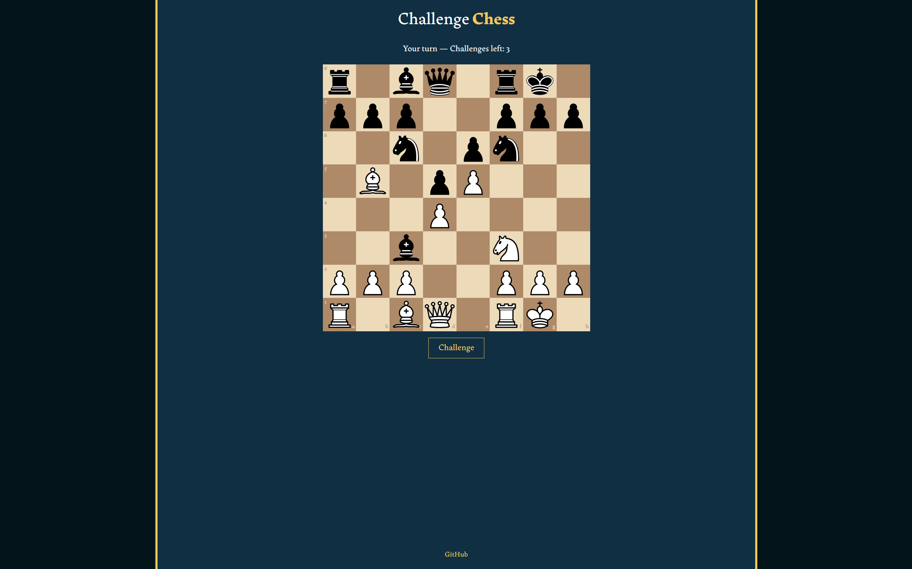

<div align="center">


# Challenge Chess

A Chess variant where players can challenge their opponent's captures before a judge.

</div>

## Preview



## How To Play

- One player creates a game and shares the code
- The other player joins with that code
- Play chess normally, but when your piece gets captured, you can challenge the move
- Both players argue their case, the AI judge rules dramatically
- Win the challenge and the move gets undone + you get a free turn
- Lose the challenge and the move stays + they get a free turn
- Each player has 3 challenges

## Run It Yourself

### You'll Need
- A [Firebase](https://console.firebase.google.com) project with Firestore enabled
- A [Gemini API key](https://aistudio.google.com/api-keys)

### Setup

```bash
git clone https://github.com/yourusername/challenge-chess
cd challenge-chess
npm install
```

Copy `.env.example` to `.env` and fill in your keys:

```
VITE_FIREBASE_API_KEY=
VITE_FIREBASE_AUTH_DOMAIN=
VITE_FIREBASE_PROJECT_ID=
VITE_FIREBASE_STORAGE_BUCKET=
VITE_FIREBASE_MESSAGING_SENDER_ID=
VITE_FIREBASE_APP_ID=
VITE_GEMINI_API_KEY=
```

```bash
npm run dev
```

To play with a friend on your local network:

```bash
npm run dev -- --host
```

Then share the IP address it gives you.

## Known Issues

- Mobile experience is poor